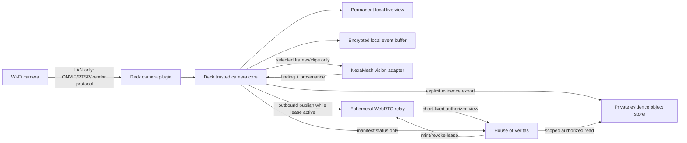

# Camera Security and Governance Integration

**Status:** Phase 0 specification; implementation not yet started  
**Baton:** `2e4d5f5d-4a90-4099-9f97-d6059ac4b54c`  
**Risk:** Security, privacy, storage, and physical-device critical path  
**Decision owner:** House of Veritas owner/admin

The first concrete workflow and its deliberately thin delivery slices are defined in
[Front-Yard Person Alert](front-yard-camera-alert-prd.md).

## 1. Decision summary

PhoenixVC Deck is the permanent, locally run camera host and live-view application. It owns LAN
discovery, camera credentials, protocol adapters, pan/tilt controls, audio controls, stream decoding,
local health, and optional encrypted local recording. House of Veritas (HOV) never receives the
continuous camera feed or camera credentials.

HOV receives only two user-authorized products:

1. a short-lived demo session with a configurable, server-enforced expiry; or
2. selected evidence consisting of a snapshot or clip plus a signed provenance manifest.

NexaMesh is an optional machine-vision provider behind a Deck plugin. It receives only the frames or
clips allowed by local policy and returns advisory findings. HOV may store those findings and their
provenance, but a human must confirm any finding before it affects a governance decision.

This split keeps the camera useful when HOV or the internet is unavailable, avoids opening inbound
ports into the household network, and gives HOV a narrow, auditable privacy boundary.

## 2. Goals and non-goals

### Goals

- Support one camera initially and several cameras without changing the domain model.
- Discover common LAN cameras and negotiate their actual capabilities instead of assuming a model.
- Provide a reliable, low-latency local live view and supported pan/tilt controls in Deck.
- Capture security events locally with bounded disk usage and explicit retention.
- Export selected, integrity-verifiable evidence into HOV.
- Create time-boxed HOV demo viewing with explicit start, countdown, revoke, and automatic expiry.
- Add optional machine-vision findings with model provenance, confidence, and human review.
- Record all external effects and sensitive reads in an audit trail.

### Non-goals

- Continuous HOV/cloud recording or a permanent HOV live stream.
- Public or guessable stream URLs.
- Router port forwarding, UPnP exposure, or direct browser access to a camera LAN address.
- Camera credentials, RTSP URLs, local IPs, or Wi-Fi secrets in HOV.
- Facial recognition, emotion inference, gait recognition, employee productivity scoring, or covert
  monitoring.
- Autonomous disciplinary, access-control, payroll, or legal decisions from vision output.
- Assuming microphone, audio, PTZ, ONVIF, RTSP, or vendor-cloud support before discovery confirms it.

## 3. System boundary



### Ownership matrix

| Concern                           | Deck                                   | HOV                                         | NexaMesh / relay                             |
| --------------------------------- | -------------------------------------- | ------------------------------------------- | -------------------------------------------- |
| Discovery, camera IP, credentials | Owns locally                           | Never receives                              | Never receives                               |
| Protocol and codec negotiation    | Owns                                   | Displays normalized capabilities            | Relay negotiates only the exported stream    |
| Permanent live view and PTZ       | Owns                                   | Not provided in v1                          | Not applicable                               |
| Local event buffer                | Owns                                   | Knows only promoted evidence                | Vision may inspect policy-selected inputs    |
| Demo authorization                | Shows local consent/active state       | Owns lease policy and viewer authorization  | Enforces media-session token and teardown    |
| Evidence                          | Creates, hashes, and uploads           | Catalogs, authorizes, retains, deletes      | Private object storage holds encrypted bytes |
| Vision result                     | Collects input and provider provenance | Requires human review before governance use | Produces advisory findings only              |

## 4. Deck camera architecture

Deck currently has a Tauri 2/Rust backend, React frontend, shared `deck-contracts`, and built-in
Tauri plugins. It does **not** yet have a Deck-level third-party camera plugin contract. That contract
is a prerequisite, not an existing capability.

### 4.1 Trusted core responsibilities

The Deck camera core must own all sensitive policy and state:

- OS-protected credential storage; credentials are passed to a plugin only for an active operation.
- Stable local camera IDs and human-friendly aliases.
- Plugin installation, signature/trust status, capability grants, and version pinning.
- Consent, privacy masks, permitted zones, recording policy, retention, disk quota, and deletion.
- Exclusive PTZ command arbitration and a visible local indicator when control or export is active.
- Demo lease validation, countdown, revocation, and relay teardown.
- Evidence hashing/signing and idempotent export.
- Append-only local audit events with secret-safe fields.
- Plugin crash isolation, timeouts, health, and resource limits.

Plugins must not receive a HOV session, a general-purpose cloud token, unrestricted filesystem
access, or permission to choose retention. A plugin declares required capabilities and Deck grants
the minimum set, such as LAN discovery, connection to an approved device, decoder access, or a
specific governed inference endpoint.

### 4.2 Normalized plugin contract

The first contract should be an internal Rust trait with an out-of-process/WASM-compatible message
shape so untrusted vendor adapters can be isolated later.

```rust
trait CameraAdapter {
    async fn discover(&self, request: DiscoveryRequest) -> Result<Vec<DeviceCandidate>>;
    async fn inspect(&self, device: LocalDeviceRef) -> Result<CameraCapabilities>;
    async fn connect(&self, device: LocalDeviceRef) -> Result<CameraSession>;
    async fn stream_profiles(&self, session: CameraSession) -> Result<Vec<StreamProfile>>;
    async fn snapshot(&self, session: CameraSession) -> Result<MediaFrame>;
    async fn ptz(&self, session: CameraSession, command: PtzCommand) -> Result<PtzResult>;
    async fn events(&self, session: CameraSession) -> Result<EventSubscription>;
}
```

Normalized capabilities include video profiles/codecs/resolution/fps, snapshot support, PTZ axes
and limits, presets, microphone/audio direction, motion/event support, clock status, and firmware
identity. An absent or failed capability is reported as `unsupported` or `unknown`; it is never
inferred from marketing text.

### 4.3 Initial adapters

1. **ONVIF adapter:** WS-Discovery plus Profile T where supported; Profile S compatibility fallback.
   ONVIF covers standardized streaming/configuration and conditional PTZ features.
2. **RTSP adapter:** manually supplied local stream URI when discovery is unavailable. Deck stores
   credentials separately and redacts them from logs and UI copy actions.
3. **Vendor adapter:** only when a required function is unavailable through ONVIF/RTSP. It must be
   isolated and explicitly granted outbound vendor-cloud access if unavoidable.
4. **Simulator adapter:** deterministic generated frames/events for CI and demos. It is always labeled
   synthetic and cannot be enabled by default in production-like mode.

### 4.4 Audio and PTZ

Microphone/audio and pan/tilt are independent capabilities. Audio capture is disabled by default,
requires its own policy and visible indicator, and is never included in evidence or demos merely
because the camera supports it. PTZ commands are rate-limited, clamped to discovered bounds, audited,
and blocked while a privacy mode is active. Preset positions are preferred over arbitrary remote
movement for demo sessions.

## 5. Security operating modes

| Mode              | Media location             | Recommended default                      | Purpose                                   |
| ----------------- | -------------------------- | ---------------------------------------- | ----------------------------------------- |
| Live only         | Memory in Deck             | Enabled                                  | Permanent local viewing without recording |
| Event buffer      | Encrypted local disk       | Opt-in; 24-hour ring and hard disk quota | Recover pre/post-event context            |
| Selected evidence | Private HOV evidence store | Manual promotion only                    | Incident or governance record             |
| HOV demo          | Ephemeral relay memory     | Off until an admin starts a lease        | Time-boxed remote demonstration           |

Recommended event capture begins with 10 seconds before and 30 seconds after a locally detected
event, retained locally for seven days unless promoted. These are policy defaults, not hard-coded
assumptions. Deck must expose retention and disk impact before enabling recording.

## 6. Short-lived HOV demo sessions

### 6.1 Policy

- Default duration: 5 minutes.
- Allowed user choice: 1 to 15 minutes.
- Estate-policy hard cap: 30 minutes; the HOV server clamps every request to this cap.
- One active demo per camera, and a small estate-wide concurrency limit.
- Admin starts and revokes sessions in v1; operator access is a later explicit policy decision.
- Deck must be online and locally unlocked or must have a separately configured unattended-export
  policy. Unattended export is off by default.
- Audio is excluded by default even when the camera supports it.
- No recording by HOV or the relay; browser recording cannot be technically guaranteed and the UI
  must state this limitation.

### 6.2 Flow

1. An HOV admin requests a demo for a camera alias, duration, purpose, and intended audience.
2. HOV creates a pending lease with a nonce, `notBefore`, `expiresAt`, audience, and policy hash.
3. Deck receives the request over its outbound authenticated channel and displays the request locally.
4. On approval, Deck publishes a derived stream outbound using WebRTC ingestion. WHIP is the
   preferred interoperable ingest contract; TURN is available for NAT traversal.
5. HOV issues a viewer token bound to the lease, user, camera alias, and expiry. Tokens are kept out
   of URLs and browser storage where practical.
6. HOV and Deck show a countdown and active-export indicator. Either side can revoke.
7. At expiry/revoke, Deck sends the media-session delete/teardown, HOV revokes viewer tokens, and the
   relay frees resources. Reconnect cannot extend the original expiry.

The lease must expire by authoritative server time even if a browser remains open. Deck also applies
the expiry independently so a HOV or relay failure cannot produce an endless stream.

## 7. Evidence export and governance

The generic HOV upload endpoint is not suitable for camera video: it currently targets local files,
allows at most 10 MB, and lacks camera-specific provenance and retention. Add a dedicated evidence
flow backed by a private object container.

### 7.1 Evidence package

```json
{
  "schemaVersion": "camera-evidence/v1",
  "evidenceId": "uuid",
  "deckId": "pseudonymous-paired-device-id",
  "cameraAlias": "front-gate",
  "capturedAt": "RFC3339 UTC",
  "capturedUntil": "RFC3339 UTC",
  "purpose": "security_incident",
  "media": {
    "mimeType": "video/mp4",
    "sizeBytes": 123,
    "sha256": "hex",
    "hasAudio": false
  },
  "source": {
    "adapterId": "onvif",
    "adapterVersion": "semver",
    "clockOffsetMs": 0
  },
  "visionFindings": [],
  "createdBy": "local-deck-user",
  "signature": "detached-signature-over-canonical-manifest"
}
```

HOV never accepts `capturedAt`, uploader identity, or role as trustworthy merely because Deck sent
them. It records receipt time, verifies the paired Deck signature, validates media type/size/content,
recomputes the object digest, and preserves both claimed and observed facts.

### 7.2 Upload protocol

1. Deck asks HOV to create an evidence intent using an idempotency key and manifest without a media
   URL.
2. HOV authorizes purpose/role and returns a single-object, short-lived upload grant.
3. Deck uploads encrypted-in-transit bytes directly to private object storage.
4. Deck finalizes the intent with the object digest; HOV verifies size/digest and marks it
   `review_required`.
5. A human reviewer classifies the evidence, adds case/task links, selects retention, and approves or
   rejects its governance use.
6. Deletion removes the bytes and records a tombstone. A legal/preservation hold blocks deletion but
   requires a reason, owner, and review date.

Evidence is not a conclusion. HOV must preserve observed facts, machine findings, human
interpretation, and final governance decisions as separate records.

## 8. NexaMesh machine-vision integration

### 8.1 Contract and placement

NexaMesh integration is a Deck vision plugin, not a camera plugin and not an HOV camera connection.
It receives a normalized `VisionJob` containing selected media, purpose, permitted detectors,
privacy-mask version, and a deadline. It returns findings with:

- detector/model name, version, and provider/deployment identity;
- input media hash and frame/time range;
- label, confidence, bounding region, and optional track ID;
- processing location (`local`, `household_edge`, or approved remote region);
- latency/cost metadata and a policy decision explaining whether output may leave Deck;
- uncertainty/failure reason; absence of a finding is not proof that an event did not occur.

### 8.2 Recommended opportunities

| Opportunity                                           | Initial posture                                       | HOV use                               |
| ----------------------------------------------------- | ----------------------------------------------------- | ------------------------------------- |
| Motion, line crossing, person/vehicle/animal presence | Good MVP candidates                                   | Create a reviewable security event    |
| Gate/door open state and package arrival              | Pilot after scene validation                          | Notification and asset/task evidence  |
| Smoke/flame or water pooling                          | Advisory only; dedicated sensors remain authoritative | Early warning, never an all-clear     |
| Asset condition or before/after work                  | Manual capture plus human review                      | Attach evidence to a task/project     |
| Contractor/work-area presence                         | Notice/consent and strict purpose required            | Attendance context, not payroll truth |
| Face identity, emotion, demographics, worker scoring  | Prohibited by default                                 | No HOV workflow                       |

NexaMesh cannot directly create a completed task, disciplinary record, access denial, or public
alert. It creates a candidate finding; a human confirms or dismisses it. Model changes require a
versioned evaluation set and threshold approval before production use.

## 9. HOV domain and API contract

### 9.1 Records

- `camera_edge`: paired Deck instance, public key, display name, status, last seen, policy version.
- `camera_alias`: opaque ID, Deck owner, display alias, normalized capabilities, privacy state. No LAN
  address or credential fields exist.
- `camera_demo_lease`: requester, purpose, audience, requested/effective duration, state, expiry,
  revoke reason, relay correlation ID.
- `camera_evidence`: manifest, receipt facts, object reference, digest, review state, retention,
  deletion/hold state.
- `camera_finding`: evidence/event link, model provenance, machine output, human decision and reason.
- `camera_audit_event`: append-only lifecycle events for pairing, viewing, PTZ if ever proxied,
  export, access, download, review, expiry, revoke, retention, and deletion.

### 9.2 Candidate routes

All routes are authenticated and Zod-validated. Admin is the initial role for pairing, demo creation,
evidence review, retention, and deletion.

| Route                                          | Purpose                                         |
| ---------------------------------------------- | ----------------------------------------------- |
| `POST /api/camera-edges/pairing-intents`       | Create one-time Deck pairing code               |
| `POST /api/camera-edges/pair`                  | Exchange code for a device identity/certificate |
| `POST /api/camera-edges/:id/heartbeat`         | Record secret-safe edge health/capabilities     |
| `POST /api/cameras/:id/demo-leases`            | Request bounded demo session                    |
| `POST /api/camera-demo-leases/:id/approve`     | Deck approves and binds relay session           |
| `POST /api/camera-demo-leases/:id/revoke`      | Immediate idempotent teardown                   |
| `GET /api/camera-demo-leases/:id/viewer-token` | Mint user/lease-bound short-lived token         |
| `POST /api/camera-evidence/intents`            | Authorize one evidence object                   |
| `POST /api/camera-evidence/:id/finalize`       | Verify object and lock manifest                 |
| `POST /api/camera-evidence/:id/reviews`        | Human confirm/reject/classify                   |
| `DELETE /api/camera-evidence/:id`              | Policy-aware byte deletion and tombstone        |

Do not extend the existing broad `AuditAction` union or generic upload authorization casually. The
camera slice needs purpose-specific permissions and resource-scoped reads so a normal authenticated
user cannot enumerate evidence or mint a viewer token.

## 10. Privacy, security, and abuse controls

- Put cameras on an isolated IoT Wi-Fi/VLAN; block camera-initiated internet access unless a vendor
  adapter explicitly requires it.
- Use a unique camera account/password, current firmware, and disable UPnP/P2P/vendor cloud when not
  needed. Do not expose camera ports through the router.
- Pair Deck to HOV with a one-time code and device-held key. Rotate/revoke the pairing without
  reconfiguring camera credentials.
- Encrypt local buffers and evidence objects; use scoped, short-lived upload and view grants.
- Place privacy masks and exclusion zones in Deck before recording or inference. Prevent PTZ presets
  from bypassing them, or treat each preset as a separately reviewed scene.
- Display recording/export/audio indicators and provide a one-action local privacy/kill switch.
- Rate-limit pairing, demo creation, viewer-token minting, evidence intents, and PTZ commands.
- Never log credentials, raw RTSP URLs, viewer/upload tokens, full LAN addresses, raw inference
  frames, or biometric templates.
- Audit evidence reads/downloads as well as writes. Alert on repeated denied reads, unexpected demo
  duration, concurrent viewers, camera clock drift, plugin trust failure, or relay teardown failure.
- Treat camera metadata, plugin output, file contents, filenames, and NexaMesh text as untrusted input.
- Complete a privacy impact assessment, household/worker notice, placement review, and retention
  decision before enabling recording. South African POPIA requires a specific lawful purpose,
  awareness of that purpose, purpose-compatible further processing, and deletion/de-identification
  when retention is no longer authorized. This specification is an engineering control set, not
  legal advice.

## 11. Setup runbook

### Before Deck support lands

1. Record the camera make/model, firmware version, mobile app, and whether its settings mention
   ONVIF, RTSP, NAS/NVR, local account, or developer access.
2. Create a unique camera password and update firmware.
3. Put the camera on an IoT Wi-Fi/VLAN where the Deck PC can reach it but untrusted IoT devices
   cannot reach household workstations generally.
4. Disable UPnP and router port forwarding. Keep the vendor cloud enabled only if needed for initial
   setup, then test whether local operation survives disabling it.
5. Decide placement, privacy masks, audio policy, and who must be informed before recording.

### Once the Deck camera module exists

1. Install the trusted ONVIF/RTSP adapter from Deck's local plugin manager.
2. Start a bounded LAN discovery. Deck lists candidates without persisting credentials.
3. Select the device, confirm its physical identity, and enter credentials into the Deck-owned OS
   credential prompt.
4. Inspect and save the normalized capability report.
5. Test snapshot, low/high stream profiles, PTZ limits/presets, events, clock drift, reconnect, and
   offline behavior. Test audio separately and leave it disabled unless explicitly approved.
6. Name the camera, draw privacy masks/zones, configure local retention/quota, and exercise the local
   privacy switch.
7. Pair Deck to HOV using a one-time code. Confirm HOV sees only the alias, capabilities, and health.
8. Export one non-sensitive test snapshot as evidence; verify digest, review, read authorization,
   deletion, and audit entries.
9. Start a one-minute muted demo, verify local/HOV countdowns, revoke early, and prove both expiry and
   reconnect denial.
10. Enable one NexaMesh detector in advisory mode and compare findings against a small labeled local
    test set before allowing notifications.

## 12. Phased implementation plan

### Phase 0 — specification and threat model (this document)

- Confirm product boundary, opportunities, non-goals, contracts, and acceptance gates.
- Record exact camera capabilities later without redesigning the boundary.

### Phase 1 — Deck local camera MVP

- Add shared camera contracts, trusted core, ONVIF/RTSP adapter, encrypted credential reference, one
  camera, local live view, snapshot, PTZ where discovered, simulator, audit, and privacy switch.
- No HOV connection, remote demo, cloud recording, or NexaMesh dependency.

### Phase 2 — HOV pairing and evidence vertical slice

- Add paired-edge identity, camera alias/health, private evidence intent/upload/finalize/review/delete,
  admin UI, retention, audit, and empty/unconfigured mode.
- Accept one manually selected image first; add bounded MP4 clips after storage and scanning limits
  are proven.

### Phase 3 — short-lived HOV demo

- Select and deploy a WebRTC/WHIP relay, add dual-enforced leases, viewer authorization, countdown,
  kill switch, metrics, and no-recording configuration.
- Run an unattended-expiry and network-partition test before enabling real camera media.

### Phase 4 — NexaMesh advisory vision

- Add vision job/result contracts, local-first adapter, model registry/provenance, evaluation corpus,
  confidence policy, human review, and cost/privacy telemetry.
- Begin with person/vehicle/animal presence or line crossing; do not start with identity.

### Phase 5 — multi-camera hardening

- Add camera groups, per-camera policies, storage quotas, concurrency limits, plugin updates/rollback,
  degraded/offline UX, backup/restore excluding credentials, and operational alerts.

## 13. Acceptance gates

No phase is complete merely because it builds or a page renders.

- **Deck local:** camera works with internet disconnected; credentials never appear in logs/state
  exports; restart reconnects; privacy switch immediately stops recording/inference/export.
- **Evidence:** cross-user reads fail; manifest/object digest matches; duplicate finalize is
  idempotent; delete removes bytes and leaves a tombstone; hold blocks deletion; receipt versus
  claimed capture time remains distinguishable.
- **Demo:** unauthorized user cannot mint/view; duration is server-clamped; expiry and revoke tear
  down media; browser reconnect after expiry fails; Deck independently stops on HOV/network failure;
  no durable relay object remains.
- **Vision:** model/version/input hash present; below-threshold and unavailable results remain
  inconclusive; model output cannot complete a governance action; human decision is attributable and
  reversible.
- **Modes:** unconfigured HOV is empty and healthy; simulator/demo data requires explicit enablement;
  no real camera is contacted in unit or CI tests.
- **Quality:** repo-specific lint, unit tests, build/type checks, Rust tests, and browser verification
  pass for the changed slice; security and privacy review is recorded separately from functional
  success.

## 14. Immediate implementation decisions still required

These do not block the architecture specification, but they gate real-device code or deployment:

1. Camera make/model and whether local ONVIF/RTSP access can be enabled.
2. Whether local recording is desired, its disk quota, and its retention period.
3. Whether audio is ever allowed for local view, evidence, or demos; default remains no.
4. The approved HOV evidence retention policy and people allowed to view/download it.
5. The NexaMesh runtime/deployment to call and whether inference must remain fully local.
6. The relay implementation/hosting budget and maximum demo duration.
7. Whether Deck may approve demos only while locally unlocked or may use an explicit unattended
   policy.

## 15. References

- ONVIF Profile S and Profile T capability documentation: <https://www.onvif.org/profiles/>
- IETF RFC 9725, WebRTC-HTTP Ingestion Protocol (WHIP):
  <https://www.rfc-editor.org/rfc/rfc9725.html>
- W3C WebRTC Recommendation: <https://www.w3.org/TR/webrtc/>
- South Africa, Protection of Personal Information Act 4 of 2013, especially purpose,
  further-processing, retention, and security safeguards:
  <https://www.justice.gov.za/legislation/acts/2013-004.pdf>
